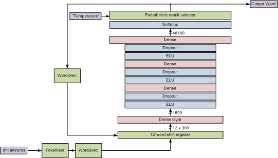

SJB Word Model
==============

This is a deep neural network model written using Keras in Python. The model predicts the next word in a sentence from the preceding 12 words which are maintained in a shift register and presented to the model in parallel. The model has 4 dense layers with interspersed droput and ELU layers. [word2vec](https://radimrehurek.com/gensim/models/word2vec.html) is used to code words as 300-element vectors which form the input to the network. The output of the model has a probabalistic selector so that it can be adjusted by "temperature" to be more or less inventive.

The model is shown diagramatically in `Network_Model.vsd`:



The model has been trained firstly on contributions from a large number of MPs, continuing until the validation loss stopped decreasing and then specifically on the contributions of Theresa May. Training on Theresa May was continued beyond the point of minimum validation loss so the model acts more like a memory, which is better for this demonstration.

The training vectors cover each sentence in the training set separately. At the beginning of a sentence, where there are fewer than 12 preceding words, '.'s are used as placeholders for no preceding text. When the model is used to predict from a few starting words, '.'s should likewise be used.

There are three steps to training and using the model:

1. Run `build_dictionary.py` to take the input text in `all_contributions.json` and create codings for the words used. Two codings are produced. The first is a simple integer code which is output to a pickle file `codetables.pickle`. This contains two dicts which map words to their code and vice versa. The second is a word2vec model. Each word is represented as a 300 number vector. The model is saved in `vmodel`.
    ```
    ./build_dictionary.py
    ```
2. Run `train.py` with a JSON file argument to train the model on that data. This reads in `codetables.pickle` and `vmodel`. The first time `train.py` is run, the file `trained_model.h5` will be created containing the Keras model and weights. As `train.py` is run subsequent times, the existing model is read in and the weights updated. It is saved every 5 epochs during training. This allows training to be restarted from where a previous run left off, or for the model to be trained on different data in succession. As well as updating `trained_model.h5`, a second file `trained_model_<nnn>_<train_accuracy>.h5` is saved to record each step of training. You can go back to one of these files as a starting point if the model subsequenly veers off. The run stops after 200 blocks of 5-epochs. If you change the word model, you must manually delete the h5 file and start again.
    ```
    ./train.py other_contributions.json
    ./train.py theresa_may_contributions.json
    ...
    ```
3. Run `create_sentence.py` to test the model and create a sentence. You can give an argument with the starting words. For instance:
    ```
   ./create_sentence.py "Surely, the right honourable gentleman cannot believe"
    ```
    If no argument is given, it produces sentences for a couple of predefined examples.

The maybot code in a higher level directory can `import create_sentence.py` to call `create_sentence()`. To make this work smoothly, a dummy `__init__.py` file has been created.


Useful Websites
---------------

https://keras.io/  
https://radimrehurek.com/gensim/models/word2vec.html  
https://github.com/oxford-cs-deepnlp-2017/lectures
